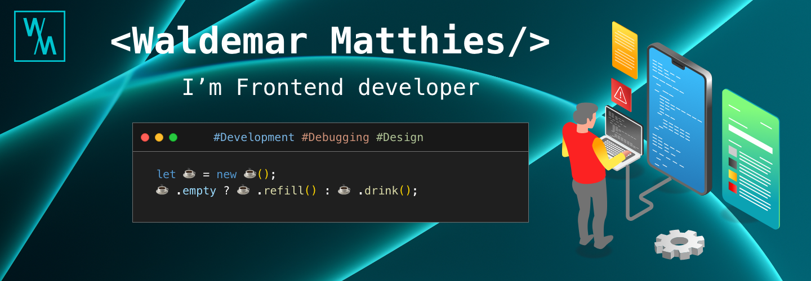

<h2>About me</h2>

- 🔭 I’m currently working on Join, Portolio

- 🌱 I’m currently learning **Angular**

You can find my portfolio [here](https://w-matthies.de).

 

 

 

 

 

 

 

 

 

<h3 align="left">Languages and Tools:</h3>

                         

<!--

-->

 [Layout Vectors by Vecteezy](https://www.vecteezy.com/free-vector/layout)